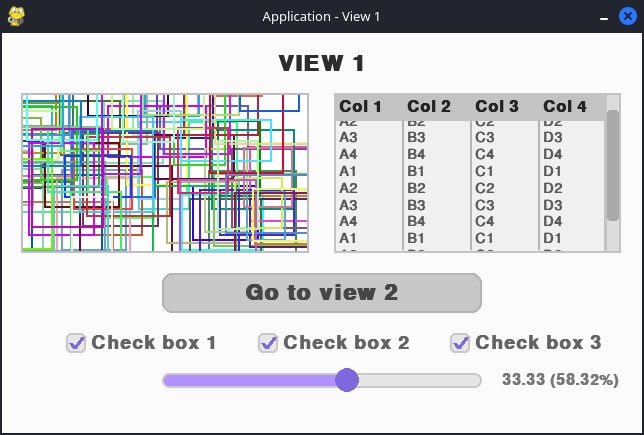
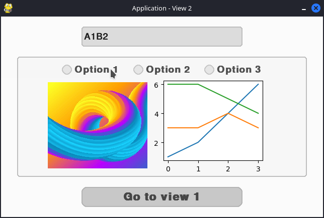
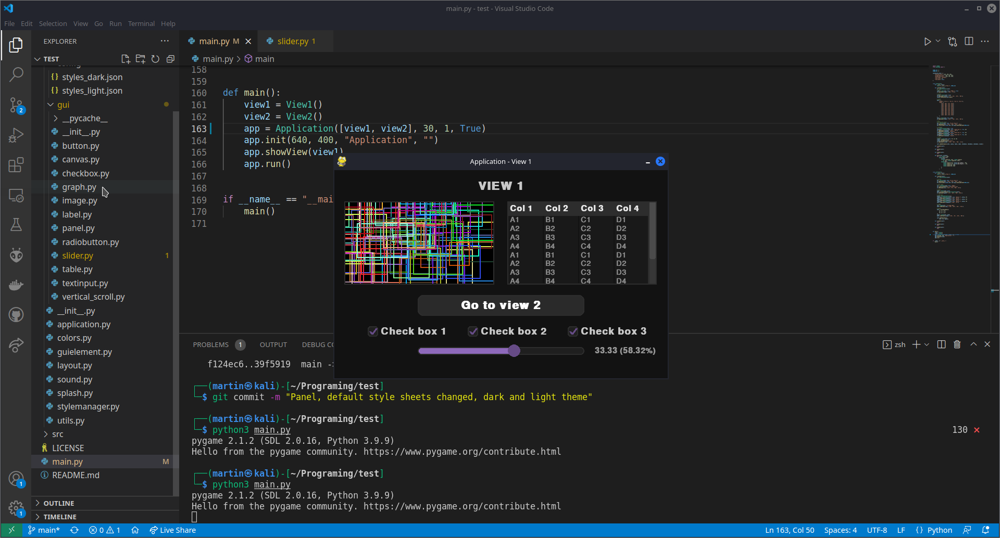

# SimpleApp framework
## About
This simple pygame-based framework allows you to divide your game/application to more views and yous GUI elemnets (form controls). In views you can use defined GUI elements (like: TextInput, Button, CheckBox, Label, ...). You can simply implement your own view with GUI elements that you want to use. Also is there posibility of customizing elements or create new one. Each element has it own style and you can modifi it in code or in config of library where are stylesheets for all elements. Almost everything is stylizable and can by stored to .json stylesheet file and loaded using style manager.
Almost everything is stylizable and can by stored to .json stylesheet file and loaded using style manager. The application basically offers two sets of style (light / dark) and it is possible to switch between them while the application is running (however, some changes will not be made until the application is restarted: typically fonts).

### Preview
> Light theme
<div>
  
  
</div>

> Dark theme


## How to use
Implement your own view
```python
class View2(View):
    def __init__(self):
        # base contructor (set name and ID of view)
        super().__init__("View 2", VIEW2_ID)

    @overrides(View)
    def createEvt(self):
        # layout manager
        al = AbsoluteLayout(self)

        # button
        btn = Button(self, None, "Go to view 1")
        # assigns button to layout manager and set properties [x_position, y_position, width, height]
        al.addElement(btn, ['25%', '85%', '50%', '40'])
        # on button click navigate to view with ID {VIEW1_ID}
        btn.setClickEvt(lambda btn: self.app.showViewWithID(VIEW1_ID))

        # add button to view element list
        self.addGUIElements([btn])

    @overrides(View)
    def closeEvt(self):
        pass

    @overrides(View)
    def openEvt(self):
        pass

    @overrides(View)
    def hideEvt(self):
        pass
        
    @overrides(View)
    def reloadStyleEvt(self):
        pass
```
In entry point of program create instance of Application, add your view, show some view and run app
```python
view1 = View1()
view2 = View2()
app = Application([view1, view2], 30, 1, True)
app.init(640, 400, "Application", "")
app.showView(view1)
app.run()
```

## Application
## View

## GUI elements
### Base class
### Label
### Image
### Button
### Canvas
### Checkbox
### Radiobutton
### Slider
### Togglebutton
### Textinput
### Graph
### Vertical scrollbar
### Table
### Panel

### Tab Panel
## Layout managers
### Absolute Layout
### Relative Layout
